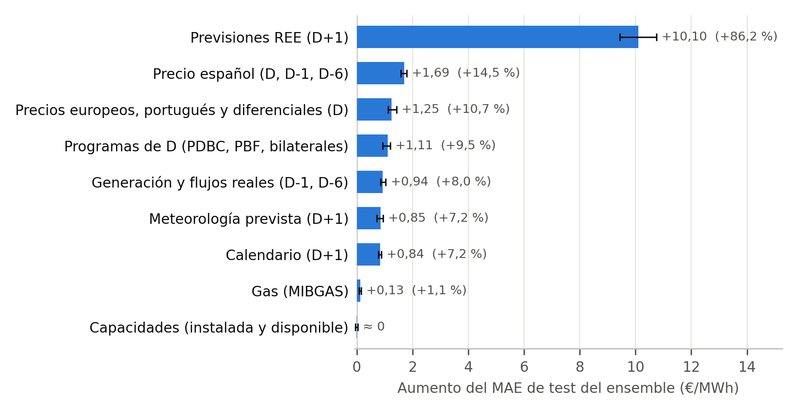

## Discusión de los resultados: explicatividad e interpretabilidad

**Por qué no hay coeficientes que leer.** El modelo final es una media ponderada de seis modelos (LightGBM, red densa, LSTM, GRU y dos seq2seq) que combinan tres formatos de entrada y dos objetivos (precio absoluto o residuo respecto al precio de D). Sin coeficientes interpretables, la explicación es posterior al entrenamiento y se ofrece en dos niveles: una permutación por grupos, agnóstica al modelo, para el sistema completo, y TreeSHAP para su miembro de mayor peso.

**Qué gobierna la predicción del sistema.** Se permutaron los 212 días de test, grupo a grupo y en todos los formatos a la vez, con tres repeticiones (Figura X). Sobre un MAE de 11,72 €/MWh, dominan las previsiones de REE para D+1: permutarlas lo eleva en 10,10 €/MWh (+86,2 %). Muy por detrás quedan el precio español de D, D-1 y D-6 (+1,69), los precios europeos (+1,25), los programas de D (+1,11), la generación y flujos reales (+0,94), la meteorología prevista (+0,85) y el calendario (+0,84). El gas (+0,13) y las capacidades apenas alteran el error, pero son variables lentas y siete meses de test no permiten descartarlas entre regímenes. Como el histórico de REE se cargó ya revisado, el +10,10 y el MAE de test pueden ser optimistas frente a producción.

**Cómo leer el precio de D.** El +1,69 no mide la dependencia del sistema respecto al precio de D: el precio portugués y los diferenciales quedan intactos en otro grupo y reconstruyen el español, y los errores de los miembros se compensan al combinarse. Permutando también el ancla del residuo, el aumento es de 20,36 €/MWh.

**El miembro de mayor peso.** En LightGBM (11/30 del ensemble), el |SHAP| medio de test se reparte entre previsiones de REE (25,5 %), precio español (19,1 %), precios europeos (18,2 %) y programas de D (12,8 %), los cuatro primeros grupos de la permutación, con un reparto casi igual en validación. Su primera variable, el precio portugués de D, supera al español, pero la separación no es interpretable: ambos correlacionan 0,997 en 2020-2026, y permutarlos juntos eleva el MAE de LightGBM en 12,38 €/MWh, más que la suma por separado (5,65 y 4,56). Permutar uno solo crea combinaciones casi inexistentes en entrenamiento, así que la cifra fiable es la conjunta.

**Contraste con el EDA.** La asociación de Spearman del EDA anticipaba mal la importancia SHAP: la correlación de rangos entre |rho| y |SHAP| de test es 0,314. Discrepan las previsiones de REE, en los puestos 34 a 43 por asociación y 2, 4 y 6 por SHAP, por motivos no comprobados.

**Comportamiento.** El ensemble se mantiene cerca de la forma de D: su perfil horario correlaciona 0,938 con el de D, frente al 0,858 del perfil real, y la magnitud media de su movimiento es el 82,6 % de la del cambio real. Ese encogimiento es la prudencia esperable ante la incertidumbre, no un sesgo corregible: escalarlo con el factor ajustado en validación empeora el test de 11,72 a 11,97 €/MWh. Por cuartiles del cambio real (Figura Y), el ensemble es peor que la persistencia en el más tranquilo (8,30 frente a 6,37 €/MWh) y reduce el error un 45,8 % en el de mayor cambio (16,31 frente a 30,09). El patrón es descriptivo y en buena parte consecuencia de la definición: los cuartiles se definen con |D+1 − D|, que por construcción es el MAE de la persistencia.

**Consecuencias para el operador y limitaciones.** Al operador de batería le importa el orden horario: el ensemble captura el 92,6 % del spread diario y sitúa el pico a ±1 h en el 76,4 % de los días, frente al 86,1 % y el 67,5 % de la persistencia. La selección optimiza, sin embargo, el MAE; hay modelos individuales que aciertan más el pico y el arbitraje justificaría un criterio específico. El operador debe asumir un cambio previsto más contenido que el real y un posible error mayor con las previsiones de REE sin revisar. Como limitaciones, los grupos correlacionados se compensan y sus aumentos no son sumables, siete meses de test infravaloran las variables lentas y ninguna medida es causal.
